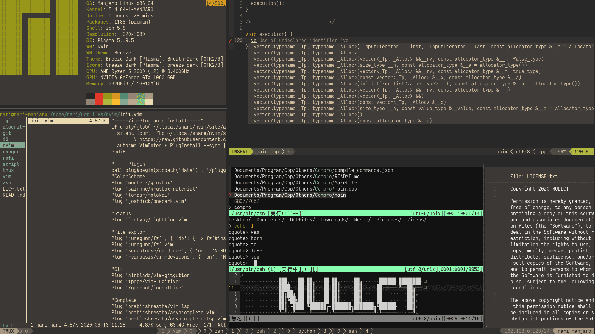

# 俺の*Dotfiles*

## tl;dr
My config for
- alacritty
- dunst
- git
- i3
- i3blocks
- kitty
- neofetch
- nvim
- ranger
- rofi
- tmux
- vim
- zsh

## Install:
1. ~/Dotfiles に設置
1. $ ~/Dotfiles/script/dotfilelinking.sh
1. えんじょい

## TODO:
- [x] Powerline化終わり。フォントはVictorMonoに
- [x] 各種キーバインドを整理/拡張
- [x] 汚い設定ファイルを直す だいたい終わったがコメントの付け方に一貫性がない

## License
MIT
